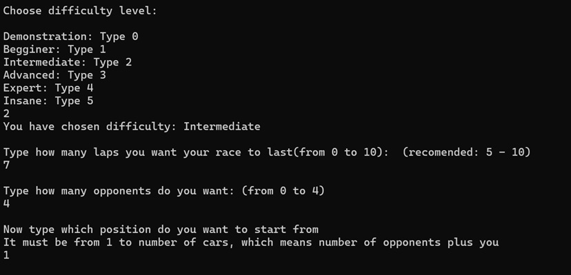
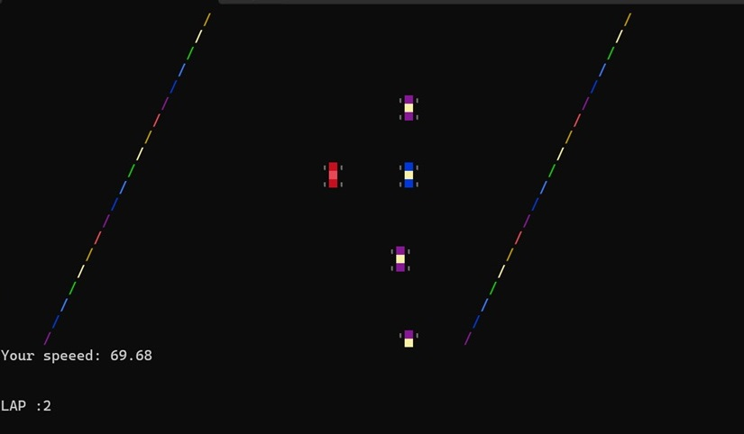

# Vistula_Valley_Raceway

## Overview
VVR is the first project in the MiNI City series of C# programming ventures, developed by students of the MiNI faculty at WUT.
It is a customizable, simple console racing game that utilizes events, multithreading and other C# features. 

## MANUAL: 

- 1. Copy the repository
- 2. Open the project in Visual Studio or other IDE
- 3. Compile the code and have fun in the game ; )

## Gameplay footage
### Starting screen, customizing your game:  

  
  
 

### Race:  

  
 
As a driver of a red car your task is to overtake opponents and cross the finish line first. 

## Project Description and Features
### Dev perspective
- The code follows object-oriented principles, ensuring modularity, reusability,     and maintainability. 
- Moreover, the code is well documented, improving readability. 
- Program runs on several threads, which is crucial for smooth player input. It also allows separation of graphic rendering and game logic. This concurrency benefits the game flow.
- Nearly every aspect of the game is customized by a player or can be easily changed in the code.  
- This includes number of cars, size of the frame, number of laps and shape of the track, maximum speed etc.
- Computer-controlled cars feature a simple but effective autonomous driving system.
- Colision system is implemented; it punishes the colision by decreasing the speed and moving you to the middle of the track.
### User perspective
- The game allows user to play using arrows to turn, accelerate and brake. 
- Objective is to win the race in previously set number of laps.
- Before starting, the player customizes their car, game settings, and even the track’s color scheme.
- The sense of speed is achieved by dynamically adjusting the console output framerate.